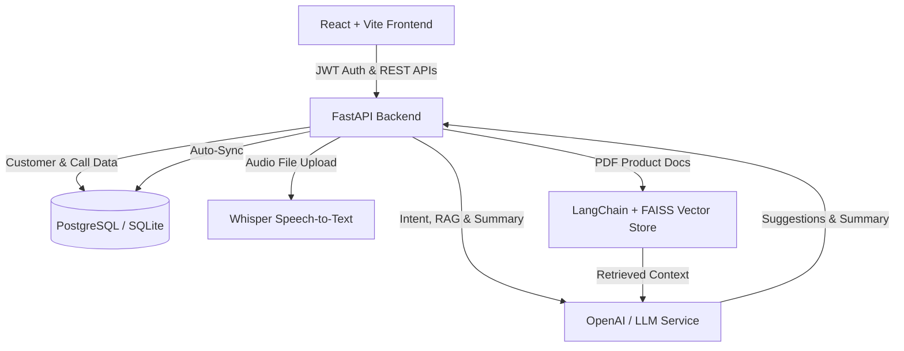

# AffordAI Voice Co-Pilot 🚀
> **Full-Stack AI Voice Assistant for Inside Sales Agents Selling Pay-in-3 Zero-Cost EMI Products**

AffordAI Voice Co-Pilot is an advanced AI assistant designed to empower inside sales agents during customer calls. By combining Whisper Speech-to-Text, LLM Intent Classification, FAISS Vector RAG, Real-time Sales Suggestions, Automated Summarization, and Mini-CRM sync, AffordAI reduces post-call wrap-up time and boosts Pay-in-3 EMI conversion rates.

---

## 🌟 Key Features

1. **Secure JWT Authentication System**
   - Role-based login system for sales agents and managers.

2. **Sales Agent Dashboard**
   - High-level KPIs: Total Customers, Total Calls, Interested Customers, Pending Follow-ups, Conversion Rate, and Recent Calls overview.

3. **Mini CRM Customer Management**
   - Store Customer Name, Phone, Email, Interest Status, KYC Status, Call Dates, Follow-up Reminders, and Call Summaries with full CRUD functionality.

4. **Product Knowledge Base (RAG)**
   - Upload PDF & TXT product guides (Pay-in-3 EMI details, eligibility criteria, interest & penalty policies, KYC process, FAQs).
   - Instant vector embedding indexing using LangChain & FAISS.

5. **Audio Recording Upload**
   - Support uploading MP3/WAV/M4A call audio files or testing with built-in pre-loaded audio calls.

6. **Whisper Speech-to-Text (STT)**
   - High-fidelity conversion of uploaded customer call audio into structured text transcripts.

7. **Intent Classification & Confidence Score**
   - Categorizes customer intent into: `Interested`, `Not Interested`, `Wants Callback`, `EMI Query`, `Eligibility Query`, `KYC Query`, or `Complaint` with a confidence score.

8. **Context-Bound RAG Q&A**
   - Interactive search engine allowing sales agents to query product documentation during calls. Answers strictly rely on retrieved vector context.

9. **AI Sales Suggestions**
   - Real-time actionable prompts for agents (e.g., *Explain Pay-in-3 benefits*, *Mention zero-cost EMI*, *Explain eligibility*, *Ask customer to complete KYC*, *Offer structured follow-up*).

10. **Structured Call Summaries**
    - Automatically extracts Customer Intent, Key Discussion Points, Next Best Action, and Follow-up Recommendations.

11. **1-Click CRM Auto-Update**
    - Automatically syncs transcript, summary, intent, follow-up date, and customer status directly into the database.

12. **Follow-up Callback Reminders**
    - Schedule and manage upcoming callback reminders with status tracking (`Pending` / `Completed`).

13. **Sales Analytics Dashboard**
    - Interactive visual charts for Daily Calls vs. Conversions, Customer Intent Distribution, Common Objections, and Follow-up Completion.

---

## 🏗️ Architecture & Data Flow



---

## 🛠️ Tech Stack

### Frontend
- **Framework**: React.js (TypeScript) + Vite
- **Styling**: Tailwind CSS + Glassmorphism Aesthetics
- **Icons**: Lucide React
- **Data Visualization**: Recharts
- **HTTP Client**: Axios

### Backend
- **Framework**: FastAPI (Python 3.10+)
- **ORM & DB Access**: SQLAlchemy
- **Authentication**: PyJWT + Passlib (Bcrypt)
- **Validation**: Pydantic v2

### AI & Vector Store
- **Speech-to-Text**: OpenAI Whisper API / Audio Extractor
- **Vector DB**: FAISS (`faiss-cpu`)
- **Embeddings**: Sentence Transformers (`all-MiniLM-L6-v2`) / OpenAI Embeddings
- **Orchestration**: LangChain

### Database & Infrastructure
- **Relational Database**: PostgreSQL (with automatic SQLite fallback for instant local dev)
- **Containerization**: Docker & Docker Compose

---

## 📁 Project Folder Structure

```
AffordAI Voice Co-Pilot/
├── frontend/                   # React + Vite + Tailwind CSS Frontend
│   ├── src/
│   │   ├── components/         # Sidebar, Header, MetricCard, etc.
│   │   ├── pages/              # Login, Dashboard, Customers, CallAssistant, KnowledgeBase, Analytics, Followups, Settings
│   │   ├── context/            # AuthContext
│   │   ├── services/           # Axios API client
│   │   ├── types.ts            # TypeScript interfaces
│   │   └── App.tsx
│   ├── package.json
│   ├── vite.config.ts
│   └── tailwind.config.js
├── backend/                    # FastAPI Application
│   ├── app/
│   │   ├── api/                # API Routers (auth, audio, documents, rag, crm, analytics, followups)
│   │   ├── core/               # Security, JWT, Configuration
│   │   ├── models/             # SQLAlchemy ORM Models
│   │   ├── schemas/            # Pydantic Schemas
│   │   ├── services/           # STT, Intent, RAG, Summary, Suggestion services
│   │   └── main.py             # FastAPI App Entrypoint
│   ├── requirements.txt
│   └── .env
├── database/                   # Database Scripts
│   ├── schema.sql              # PostgreSQL DDL Schema
│   └── seed.sql                # Initial Seed Data
├── uploads/                    # Audio storage directory (contains sample_sales_call.wav)
├── knowledge_base/             # Product PDF knowledge base (contains pay_in_3_product_guide.pdf)
├── vector_store/               # FAISS vector index persistence directory
├── scripts/                    # Helper scripts (sample PDF & WAV generators)
├── docker-compose.yml          # Full-stack Docker compose configuration
├── Dockerfile.backend
├── Dockerfile.frontend
└── README.md
```

---

## 🚀 Quick Start Guide

### Prerequisites
- Python 3.10+
- Node.js 18+ and npm
- Docker (Optional)

---

### Method 1: Local Development Setup (Quickest)

#### 1. Backend Setup
```bash
# Navigate to backend directory
cd backend

# Create virtual environment (optional but recommended)
python -m venv venv
# On Windows:
venv\Scripts\activate
# On Linux/macOS:
source venv/bin/activate

# Install requirements
pip install -r requirements.txt

# Run FastAPI Server
uvicorn app.main:app --reload --port 8000
```
> The API server starts at `http://localhost:8000`. Interactive OpenAPI documentation is available at `http://localhost:8000/docs`.

#### 2. Frontend Setup
```bash
# Open a new terminal and navigate to frontend directory
cd frontend

# Install Node dependencies
npm install

# Start Vite Development Server
npm run dev
```
> The React Web App will run at `http://localhost:3000`.

---

### Method 2: Docker Compose Setup

Run the entire full-stack application (PostgreSQL + FastAPI + React Frontend) with one command:

```bash
docker-compose up --build
```

- **Frontend Application**: `http://localhost:3000`
- **FastAPI Backend & Docs**: `http://localhost:8000/docs`
- **PostgreSQL Database**: `localhost:5432`

---

## 🔐 Default Demo Credentials

| Role | Email | Password |
|---|---|---|
| **Sales Agent** | `agent@affordai.com` | `password123` |

---

## 📡 Key Backend API Endpoints

| Method | Endpoint | Description |
|---|---|---|
| `POST` | `/api/v1/login` | Authenticate agent & return JWT token |
| `POST` | `/api/v1/upload-audio` | Upload MP3/WAV audio & return Whisper transcript |
| `POST` | `/api/v1/intent` | Classify customer intent & confidence score |
| `POST` | `/api/v1/rag` | Query vector database for RAG context answer |
| `POST` | `/api/v1/summary` | Synthesize structured call summary |
| `POST` | `/api/v1/suggestions` | Retrieve real-time sales recommendations |
| `POST` | `/api/v1/crm/save` | Auto-save call transcript, summary & status to CRM |
| `GET` | `/api/v1/customers` | List all CRM customer records |
| `POST` | `/api/v1/upload-document` | Upload PDF to Knowledge Base & index FAISS embeddings |
| `GET` | `/api/v1/analytics` | Fetch chart data for sales performance |
| `GET` | `/api/v1/followups` | Retrieve scheduled callback reminders |

---

## 🗄️ Database Tables (Schema)

1. `users`: Stores agent credentials and roles.
2. `customers`: Stores CRM leads, interest classification, and KYC status.
3. `calls`: Logs call metadata, duration, intent, and summary.
4. `transcripts`: Stores full Speech-to-text call transcripts.
5. `followups`: Tracks callback dates and completion statuses.
6. `products`: Tracks Pay-in-3 product documentation references.

---

## 📄 License
Licensed under the MIT License. Built for AffordAI Inside Sales Teams.
